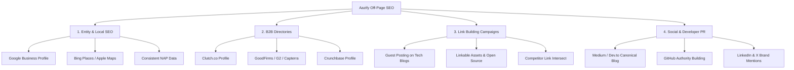

# Aazify Off-Page SEO Strategy & Execution Blueprint

Off-page SEO refers to actions taken outside of your own website to impact your rankings within search engine results pages (SERPs). For a custom software, mobile app, and AI solutions agency like **Aazify (AAZ Developers)**, off-page SEO is the primary driver of domain authority, brand credibility, search rankings, and high-ticket B2B client leads.

This document outlines a professional, step-by-step strategy to execute Aazify's off-page SEO campaign.

---

## 🗺️ Strategy Overview & Core Pillars

---

## 1. Entity, Local SEO & Knowledge Graph Alignment
Search engines (specifically Google) now rank websites based on **Entities** (real-world concepts/organizations) rather than just keyword matches. Connecting Aazify's online footprints builds a strong Google Knowledge Graph node.

### A. Google Business Profile (GBP) & Local Maps
1. **Claim/Verify Profile:** Set up a Google Business Profile under the legal name: **Aazify** or **Aazify - Software Development & AI Solutions**.
2. **Category Selection:** 
   - Primary Category: *Software Company* or *Web Developer*.
   - Secondary Categories: *Computer Consultant*, *Information Technology Service*.
3. **Consistency of NAP (Name, Address, Phone):**
   - **Name:** Aazify
   - **Phone:** `+92 300 7395147` (WhatsApp)
   - **Email:** `contact@aazify.com`
   - *Note: Ensure this matches the exact telephone and address format used in the website footer and the JSON-LD schema we've injected on the site.*
4. **Acquire Reviews:** Send your custom review link to every client. Reviews containing keywords like "custom software development", "next.js web app", "POS system", or "AI automation" carry massive rank weight.

### B. Bing Places & Apple Maps
* Duplicate all listings on **Bing Places for Business** and **Apple Maps Connect**. Bing powers search results for DuckDuckGo and Alexa, which are valuable sources of high-authority off-page signals.

---

## 2. High-Authority B2B Directories & Reviews
For software agencies, backlinks from B2B directories are highly curated, relevant, and drive direct lead traffic.

| Directory | Domain Authority (DA) | Value to Aazify | Strategy |
| :--- | :---: | :---: | :--- |
| **Clutch.co** | 76 | Extremely High | Set up a free profile. Target reviews from your 50+ delivered projects. This is the #1 platform where international clients hire development teams. |
| **Crunchbase** | 90 | High | Create an organization profile for Aazify and personal profiles for founders. Backlinks from Crunchbase are clean, trusted, and pass strong entity signals. |
| **G2 / Capterra** | 90+ | Medium-High | Best for showcasing Aazify's SaaS products (Cold Store Management, POS, Mandi Management, Restaurant Management). |
| **GoodFirms** | 68 | Medium | Similar to Clutch. Create a profile and list core competencies: Mobile App, Web, and AI solutions. |
| **Trustpilot** | 92 | Medium | Great for brand search credibility. Add a trust badge link on the site later. |

---

## 3. High-Quality Backlink Campaigns (Link Building)
Backlinks are search engine votes of confidence. Aazify needs high-relevance, high-authority links from tech, business, and software dev websites.

### A. High-Impact Guest Blogging
Write high-quality technical or business automation articles for external tech/business blogs in exchange for a contextual backlink.

#### Pitch Template 1: Initial Outreach to Tech/SaaS Blogs
> **Subject:** Pitch: Evolving POS systems / AI agents for local retail
>
> Hello [Editor's Name],
>
> I’ve been following your articles on [Blog Name] regarding [related topic, e.g., retail tech / modern web technologies]. 
>
> I am a software engineer at Aazify. I wanted to ask if you'd be interested in a high-quality guest piece discussing one of the following topics:
> 1. **How AI Agents (Agentic AI) Are Replacing Standard Chatbots in B2B Operations**
> 2. **The Modern Retail Stack: Why Traditional POS Systems Fail in 2026**
> 3. **Next.js & Server Actions: Building Scalable SaaS Architectures Without the Overhead**
>
> I promise our content is 100% original, practical, and highly engaging for your audience, drawing from our team's experience building software systems for 50+ businesses.
>
> Looking forward to your thoughts!
>
> Best regards,  
> **[Your Name]**  
> Software Engineer, [Aazify](https://aazify.com)

### B. Linkable Assets (The Honey-Pot Technique)
Instead of asking for links, build assets that writers and developers *want* to link to:
1. **Open Source Tools (GitHub):** 
   - Set up an official Aazify GitHub Organization.
   - Release free developer utilities, Boilerplates (e.g., *Next.js + Tailwind CSS boilerplate for POS systems*), or custom React hooks.
   - **Why:** GitHub has a Domain Authority of 97. Backlinks in Readmes and repository descriptions contribute significantly to search credibility.
2. **Free Business Calculators:**
   - Create a subpage (e.g., `/tools/mandi-commission-calculator` or `/tools/fbr-tax-calculator`).
   - Write simple UI widgets. Other local business resource websites, accountants, or financial blogs will naturally link to these tools as references.
3. **Data-Driven Case Studies:**
   - Publish detailed write-ups on how you automated cold stores or restaurants, with actual metrics (e.g., "How automating cold storage inventory reduced room wastage by 34%"). Case studies are frequently linked by business bloggers as research references.

### C. Competitor Link Intersect Analysis
1. Use an SEO tool (e.g., Ahrefs, Semrush, or Moz Link Explorer) to input your top 3 local/international agency competitors.
2. Filter for websites linking to *multiple* competitors but not Aazify.
3. Reach out to those websites (directories, local blogs, resource pages) and propose listing Aazify as a superior or alternative option.

---

## 4. Digital PR, Content Syndication & Social Signals
Social signals do not directly pass PageRank, but they increase brand search volume, traffic, and organic backlinks.

### A. Developer Communities & Forums
* **Dev.to / Hashnode / Medium:** Syndicate your engineering blog posts on these high-authority blogging networks. 
  > [!IMPORTANT]
  > Always set the `canonical URL` of your Medium/Dev.to articles to the original blog post on `https://aazify.com/blog/...`. This tells Google that Aazify is the original source, passing the search authority to your domain.
* **Reddit & Quora:** Find questions relating to "cold storage software", "best POS systems in Pakistan", or "integrating FBR in Next.js". Write informative, non-spammy answers. Include a contextual link back to Aazify’s landing pages when highly relevant.

### B. GitHub & Social Profiles
* Ensure Aazify's GitHub, LinkedIn, Facebook, Instagram, YouTube, TikTok, and Pinterest accounts are fully active and link back to `https://aazify.com`.
* Keep the bios consistent: **Aazify | Build Smart. Scale Fast. Succeed Digitally.**

---

## 📅 Monthly Off-Page SEO Checklist
To maintain steady growth in domain authority, stick to the following monthly schedule:

- [ ] **Week 1:** Publish 1 value-packed article on Aazify's blog, and syndicate it to Medium and Dev.to (with canonical tags).
- [ ] **Week 2:** Pitch 5 guest blogging sites with technical or business case studies.
- [ ] **Week 3:** Gather 2 new client reviews on Clutch.co and Google Business Profile.
- [ ] **Week 4:** Share 2 project demos or open-source packages on GitHub/LinkedIn to drive social sharing.
